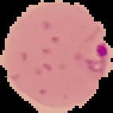

# CNN for Malaria Detection

In this project, a simple CNN will be built using Tensorflow to detect Malaria from thin blood slide images. The Dataset is taken from the official [NIH Website](https://ceb.nlm.nih.gov/repositories/malaria-datasets/).

## Dataset Preview

|   Parasitized Cell    |  Uninfected Cell   |
| :----------: | :----------: |
|  |  |

## Evaluation

|   Classes    |  Precision   |    Recall    |   F1 Score   |
| :---------: | :---------: | :---------: | :---------: |
| Parasitized (0) | 0.96 | 0.93 | 0.95 |
| Uninfected (1) | 0.93 | 0.97 | 0.95 |

